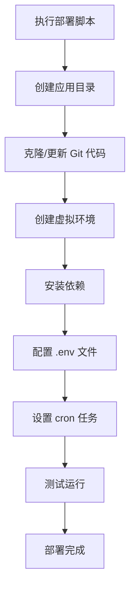

# Design Document

## Overview

本设计文档描述了将 AI 新闻机器人从阿里云迁移到 DigitalOcean 服务器的 MVP 技术方案。采用最简化的架构，使用标准 Linux 工具（目录结构、Python venv、cron）实现多应用隔离和自动化部署，避免引入复杂的服务管理和监控系统。

**核心设计原则：**
- 简单优先：使用 cron 而非 systemd
- 标准工具：依赖 Linux 原生命令
- 快速部署：单个脚本完成所有配置
- 易于维护：清晰的目录结构和日志

## Architecture

### System Architecture

```
DigitalOcean Server (Ubuntu 22.04)
├── /opt/apps/                    # 应用根目录
│   ├── ai-news-bot/              # AI 新闻机器人
│   │   ├── code/                 # Git 仓库代码
│   │   ├── venv/                 # Python 虚拟环境
│   │   ├── logs/                 # 应用日志
│   │   └── .env                  # 环境变量
│   ├── app2/                     # 未来的其他应用
│   └── app3/
├── /usr/local/bin/
│   └── deploy-app.sh             # 通用部署脚本
└── Cron Jobs                     # 定时任务管理
```

### Deployment Flow



## Components and Interfaces

### 1. Deployment Script (`deploy-app.sh`)

通用部署脚本，支持部署任意 Python 应用。

**接口：**
```bash
deploy-app.sh <app_name> <git_repo_url> [cron_schedule]
```

**参数：**
- `app_name`: 应用名称（如 ai-news-bot）
- `git_repo_url`: Git 仓库地址
- `cron_schedule`: 可选，cron 表达式（如 "0 9 * * *"）

**功能模块：**
- 目录初始化
- Git 代码管理
- 虚拟环境管理
- 依赖安装
- Cron 配置
- 日志设置

### 2. Application Directory Structure

每个应用的标准目录结构：

```
/opt/apps/{app_name}/
├── code/                 # Git 仓库（包含所有源代码）
│   ├── bot_wecom.py
│   ├── requirements.txt
│   └── ...
├── venv/                 # Python 虚拟环境
│   ├── bin/
│   ├── lib/
│   └── ...
├── logs/                 # 应用日志
│   ├── app.log
│   ├── app.log.1
│   └── ...
└── .env                  # 环境变量配置
```

### 3. Cron Job Management

使用 cron 管理定时任务，每个应用一个 cron 条目。

**Cron 条目格式：**
```bash
# AI News Bot - Daily at 9:00 AM
0 9 * * * cd /opt/apps/ai-news-bot/code && /opt/apps/ai-news-bot/venv/bin/python3 bot_wecom.py >> /opt/apps/ai-news-bot/logs/app.log 2>&1
```

**特点：**
- 自动激活虚拟环境
- 日志重定向到应用目录
- 注释标识应用名称

### 4. Environment Variable Management

使用 `.env` 文件管理敏感配置。

**安全措施：**
- 文件权限：600（仅所有者可读写）
- 不纳入版本控制
- 应用启动时自动加载（通过 python-dotenv）

**示例 .env 文件：**
```bash
DEEPSEEK_API_KEY=sk-xxxxx
WECOM_WEBHOOK_URL=https://qyapi.weixin.qq.com/cgi-bin/webhook/send?key=xxxxx
TIANAPI_KEY=xxxxx
ACTIVE_TOPICS=ai,education
```

### 5. Log Management

简单的日志管理策略。

**日志位置：** `/opt/apps/{app_name}/logs/app.log`

**日志轮转：** 使用 logrotate 配置
```
/opt/apps/*/logs/app.log {
    daily
    rotate 10
    compress
    missingok
    notifempty
}
```

## Data Models

### Application Configuration

```python
{
    "app_name": "ai-news-bot",
    "git_repo": "https://github.com/yalding8/ai-news-bot.git",
    "app_dir": "/opt/apps/ai-news-bot",
    "code_dir": "/opt/apps/ai-news-bot/code",
    "venv_dir": "/opt/apps/ai-news-bot/venv",
    "logs_dir": "/opt/apps/ai-news-bot/logs",
    "env_file": "/opt/apps/ai-news-bot/.env",
    "cron_schedule": "0 9 * * *",
    "entry_point": "bot_wecom.py"
}
```

### Deployment State

```python
{
    "app_name": "ai-news-bot",
    "status": "deployed",
    "last_deploy_time": "2025-11-24T10:30:00Z",
    "git_commit": "abc123def456",
    "python_version": "3.10.12",
    "cron_enabled": true
}
```

## Correctness Properties

*A property is a characteristic or behavior that should hold true across all valid executions of a system-essentially, a formal statement about what the system should do. Properties serve as the bridge between human-readable specifications and machine-verifiable correctness guarantees.*

### Property 1: Directory Isolation

*For any* two applications deployed on the Target Server, their application directories SHALL be completely separate and SHALL NOT share any files except system-level dependencies.

**Validates: Requirements 1.1, 1.2, 1.3**

### Property 2: Virtual Environment Independence

*For any* application, installing or updating dependencies SHALL only modify files within that application's virtual environment directory and SHALL NOT affect other applications' dependencies.

**Validates: Requirements 2.1, 2.2, 2.3**

### Property 3: Cron Job Execution

*For any* application with a configured cron schedule, the cron job SHALL execute at the specified time using the application's virtual environment and SHALL write output to the application's log file.

**Validates: Requirements 3.1, 3.2, 3.3**

### Property 4: Deployment Idempotence

*For any* application, running the deployment script multiple times with the same parameters SHALL produce the same final state without errors.

**Validates: Requirements 4.1, 4.2, 4.3, 4.4**

### Property 5: Environment Variable Security

*For any* application's .env file, the file permissions SHALL be set to 600 and the file SHALL NOT be readable by users other than the owner.

**Validates: Requirements 5.1, 5.2**

### Property 6: Log File Accessibility

*For any* application, when the application writes log output, the log file SHALL be created in the application's logs directory and SHALL be readable by the application owner.

**Validates: Requirements 7.1, 7.2**

## Error Handling

### Deployment Errors

**Git Clone/Pull Failures:**
- 检测：Git 命令返回非零退出码
- 处理：输出错误信息，停止部署
- 恢复：用户检查网络和仓库权限后重新运行

**Dependency Installation Failures:**
- 检测：pip install 返回非零退出码
- 处理：输出错误信息，保留虚拟环境供调试
- 恢复：修复 requirements.txt 后重新运行

**Cron Configuration Failures:**
- 检测：crontab 命令失败
- 处理：输出错误信息，应用仍可手动运行
- 恢复：检查 cron 服务状态，修复后重新配置

### Runtime Errors

**Application Execution Failures:**
- 检测：应用退出码非零或异常日志
- 处理：错误信息写入日志文件
- 恢复：查看日志，修复代码或配置后重新部署

**Environment Variable Missing:**
- 检测：应用启动时 python-dotenv 加载失败
- 处理：应用输出错误信息到日志
- 恢复：创建或修复 .env 文件

**Disk Space Exhaustion:**
- 检测：日志文件无法写入
- 处理：应用可能静默失败或输出到 stderr
- 恢复：手动清理日志或增加磁盘空间

## Testing Strategy

### Unit Testing

本项目主要涉及部署脚本和配置，单元测试覆盖：

1. **部署脚本函数测试**
   - 测试目录创建函数
   - 测试 Git 操作函数
   - 测试 cron 配置生成函数

2. **配置验证测试**
   - 测试 .env 文件权限检查
   - 测试 cron 表达式验证
   - 测试路径规范化

### Property-Based Testing

使用 Python 的 `hypothesis` 库进行属性测试。

**配置要求：**
- 每个属性测试运行至少 100 次迭代
- 使用 `@given` 装饰器生成随机测试数据
- 每个测试必须标注对应的设计属性

**测试框架：** pytest + hypothesis

**示例测试结构：**
```python
from hypothesis import given, strategies as st
import pytest

@given(app_name=st.text(min_size=1, max_size=50, alphabet=st.characters(whitelist_categories=('Ll', 'Nd', '-'))))
def test_property_1_directory_isolation(app_name):
    """
    Feature: digitalocean-migration, Property 1: Directory Isolation
    """
    # Test implementation
    pass
```

### Integration Testing

**部署流程集成测试：**
1. 在测试环境运行完整部署脚本
2. 验证所有目录和文件创建正确
3. 验证 cron 任务配置正确
4. 验证应用可以成功执行

**迁移验证测试：**
1. 部署 AI 新闻机器人
2. 手动触发应用执行
3. 验证新闻获取和推送功能
4. 检查日志输出

### Manual Testing Checklist

部署后手动验证清单：

- [ ] 目录结构正确创建
- [ ] 虚拟环境包含所有依赖
- [ ] .env 文件权限为 600
- [ ] cron 任务已添加到 crontab
- [ ] 手动运行应用成功
- [ ] 日志文件正确写入
- [ ] 等待 cron 自动执行验证

## Implementation Notes

### Server Requirements

**操作系统：** Ubuntu 22.04 LTS

**必需软件包：**
```bash
apt install -y python3 python3-pip python3-venv git logrotate
```

**推荐配置：**
- 2 CPU cores
- 2 GB RAM
- 20 GB SSD
- 稳定网络连接

### Security Considerations

**最小化安全措施（MVP）：**

1. **SSH 访问：** 使用 SSH 密钥认证（DigitalOcean 默认）
2. **文件权限：** .env 文件设置为 600
3. **防火墙：** 仅开放必要端口（SSH 22）
4. **用户权限：** 使用 root 用户（简化 MVP，生产环境应使用非 root 用户）

### Migration Steps for AI News Bot

**具体迁移步骤：**

1. **准备 DigitalOcean 服务器**
   ```bash
   # 连接服务器
   ssh root@your-server-ip
   
   # 安装依赖
   apt update && apt upgrade -y
   apt install -y python3 python3-pip python3-venv git logrotate
   ```

2. **上传部署脚本**
   ```bash
   # 将 deploy-app.sh 上传到服务器
   scp deploy-app.sh root@your-server-ip:/usr/local/bin/
   chmod +x /usr/local/bin/deploy-app.sh
   ```

3. **执行部署**
   ```bash
   deploy-app.sh ai-news-bot https://github.com/yalding8/ai-news-bot.git "0 9 * * *"
   ```

4. **配置环境变量**
   ```bash
   nano /opt/apps/ai-news-bot/.env
   # 填入 API keys
   chmod 600 /opt/apps/ai-news-bot/.env
   ```

5. **测试运行**
   ```bash
   cd /opt/apps/ai-news-bot/code
   /opt/apps/ai-news-bot/venv/bin/python3 bot_wecom.py
   ```

6. **验证 cron 任务**
   ```bash
   crontab -l
   # 等待第二天 9:00 AM 自动执行
   ```

### Future Enhancements (Post-MVP)

当 MVP 验证成功后，可以考虑添加：

1. **systemd 服务管理** - 替代 cron，支持服务监控和自动重启
2. **健康检查** - 定期检查应用状态
3. **监控告警** - 集成 Prometheus/Grafana
4. **自动备份** - 定期备份配置和数据
5. **CI/CD 集成** - GitHub Actions 自动部署
6. **非 root 用户** - 提升安全性
7. **Nginx 反向代理** - 支持 Web 应用

## Deployment Script Specification

### Script Interface

```bash
#!/bin/bash
# deploy-app.sh - Universal Python application deployment script

Usage: deploy-app.sh <app_name> <git_repo_url> [cron_schedule]

Arguments:
  app_name        Application name (alphanumeric and hyphens only)
  git_repo_url    Git repository URL
  cron_schedule   Optional cron schedule (e.g., "0 9 * * *")

Examples:
  deploy-app.sh ai-news-bot https://github.com/user/repo.git "0 9 * * *"
  deploy-app.sh my-app https://github.com/user/my-app.git
```

### Script Functions

**1. validate_inputs()**
- 验证应用名称格式
- 验证 Git URL 格式
- 验证 cron 表达式（如果提供）

**2. setup_directories()**
- 创建 /opt/apps/{app_name}
- 创建 code, venv, logs 子目录
- 设置适当的权限

**3. manage_git_repo()**
- 检查代码目录是否存在
- 如果不存在，执行 git clone
- 如果存在，执行 git pull

**4. setup_virtualenv()**
- 创建 Python 虚拟环境
- 升级 pip
- 安装 requirements.txt 依赖

**5. configure_env_file()**
- 检查 .env 文件是否存在
- 如果不存在，创建模板
- 设置权限为 600

**6. setup_cron_job()**
- 生成 cron 条目
- 添加到 crontab
- 避免重复添加

**7. setup_log_rotation()**
- 创建 logrotate 配置
- 配置日志保留策略

**8. test_deployment()**
- 验证所有目录存在
- 验证虚拟环境可用
- 输出部署摘要

### Error Handling in Script

```bash
set -e  # 遇到错误立即退出
set -u  # 使用未定义变量时报错
set -o pipefail  # 管道命令中任何失败都会导致整体失败

# 错误处理函数
error_exit() {
    echo "ERROR: $1" >&2
    exit 1
}

# 使用示例
git clone "$GIT_REPO" "$CODE_DIR" || error_exit "Failed to clone repository"
```

## Monitoring and Maintenance

### Log Monitoring

**查看实时日志：**
```bash
tail -f /opt/apps/ai-news-bot/logs/app.log
```

**搜索错误：**
```bash
grep -i "error\|failed\|exception" /opt/apps/ai-news-bot/logs/app.log
```

**查看最近 100 行：**
```bash
tail -n 100 /opt/apps/ai-news-bot/logs/app.log
```

### Cron Job Management

**查看所有 cron 任务：**
```bash
crontab -l
```

**编辑 cron 任务：**
```bash
crontab -e
```

**验证 cron 服务状态：**
```bash
systemctl status cron
```

### Application Updates

**更新应用代码：**
```bash
cd /opt/apps/ai-news-bot/code
git pull
/opt/apps/ai-news-bot/venv/bin/pip install -r requirements.txt --upgrade
```

**或重新运行部署脚本：**
```bash
deploy-app.sh ai-news-bot https://github.com/yalding8/ai-news-bot.git "0 9 * * *"
```

### Troubleshooting Guide

**问题 1: Cron 任务不执行**
```bash
# 检查 cron 服务
systemctl status cron

# 检查 cron 日志
grep CRON /var/log/syslog

# 验证时区
timedatectl
```

**问题 2: 依赖安装失败**
```bash
# 手动激活虚拟环境
source /opt/apps/ai-news-bot/venv/bin/activate

# 尝试手动安装
pip install -r /opt/apps/ai-news-bot/code/requirements.txt -v
```

**问题 3: 环境变量未加载**
```bash
# 检查 .env 文件存在
ls -la /opt/apps/ai-news-bot/.env

# 检查权限
stat /opt/apps/ai-news-bot/.env

# 验证内容
cat /opt/apps/ai-news-bot/.env
```
